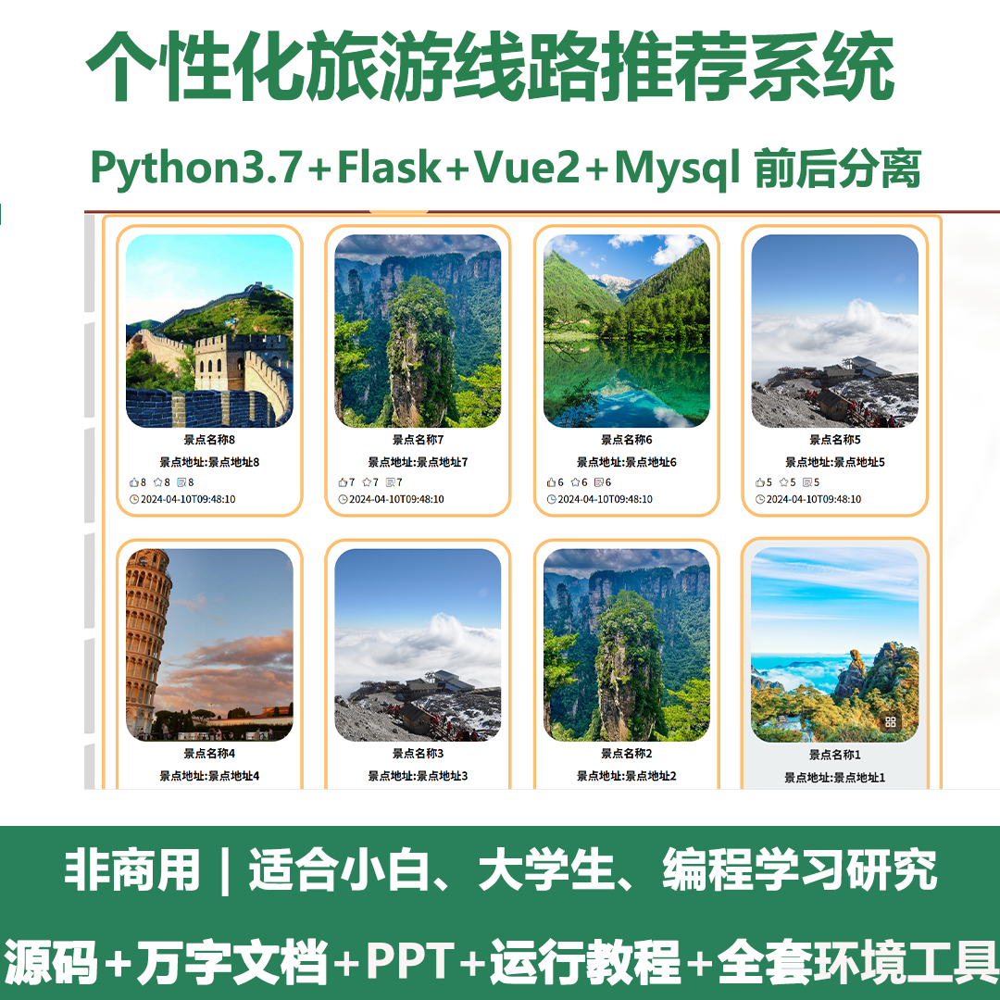
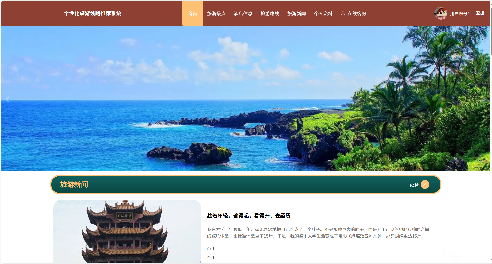
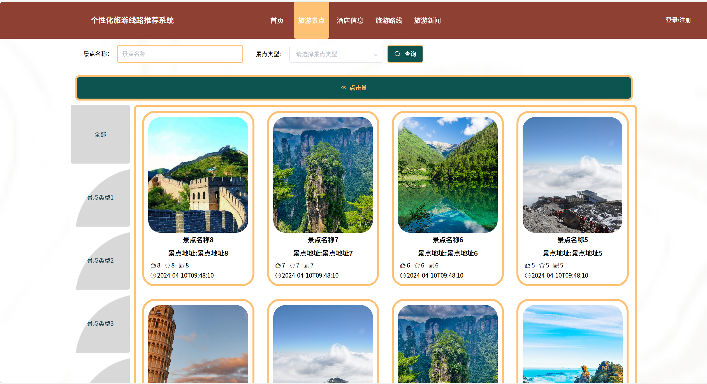
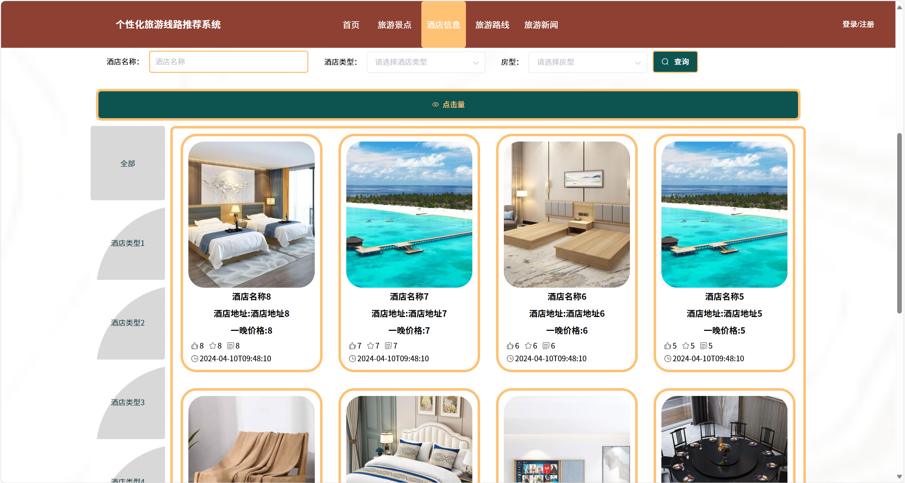
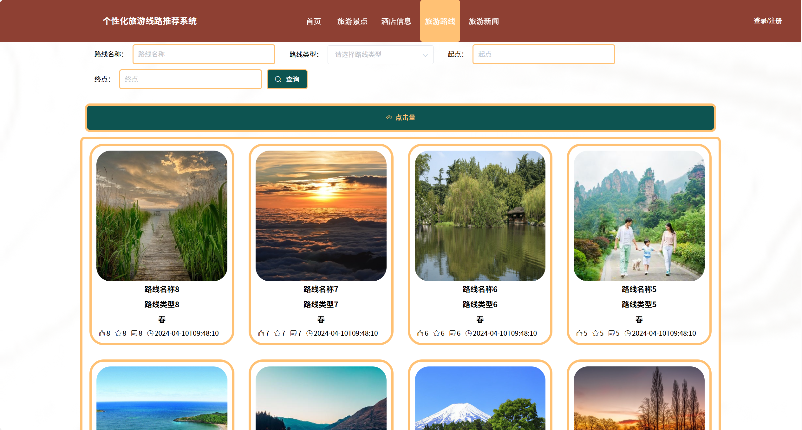
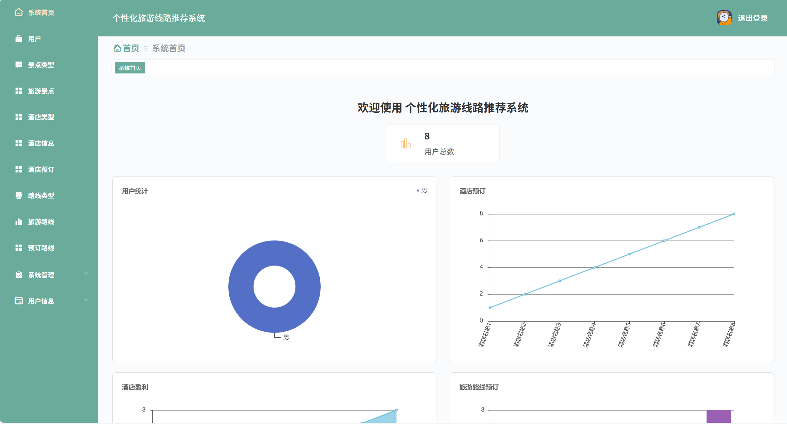
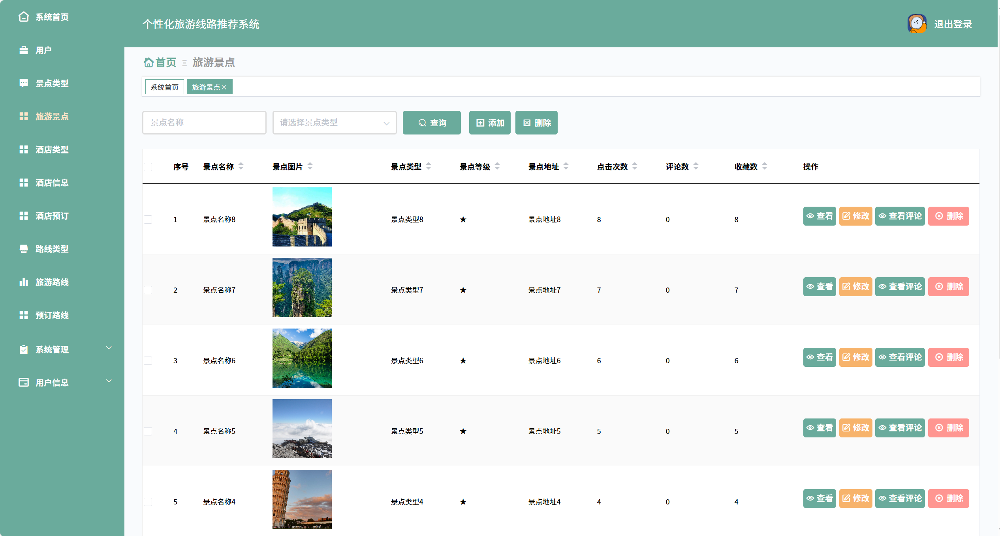
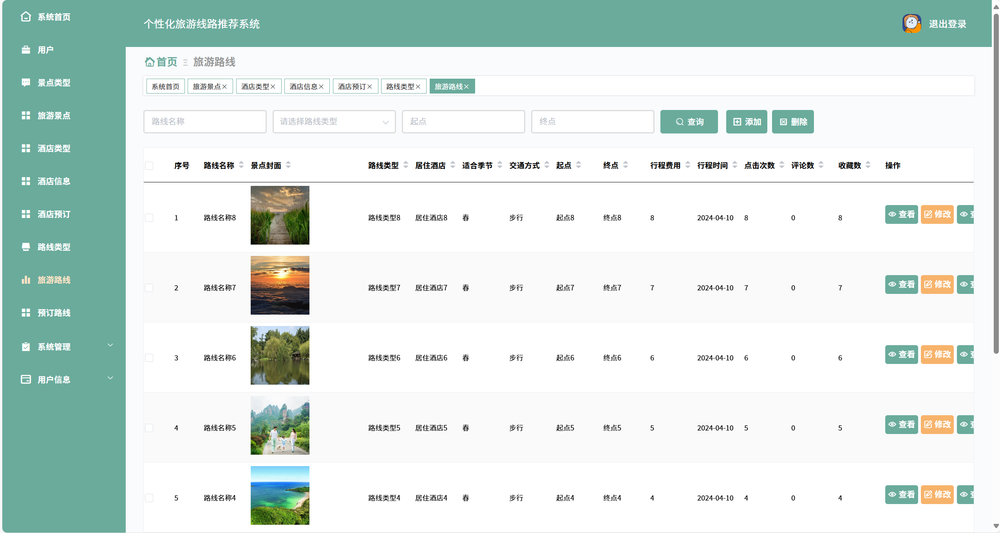
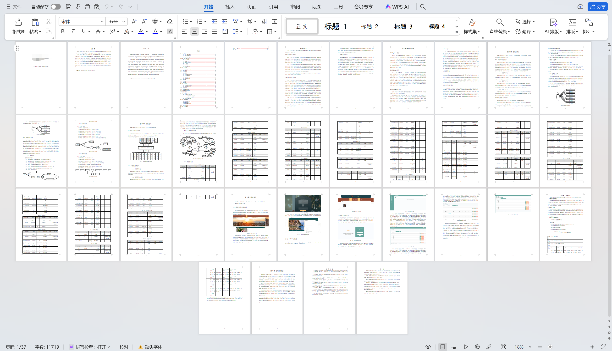

# python108
python108基于Python+Flask的个性化旅游线路推荐系统+LW+PPT
 
## 源码问题查看主页咨询

### 一、关键词
个性化旅游线路推荐系统，定制化旅游行程推荐系统，个性化旅游路线定制系统

### 二、作品包含
源码+数据库+设计文档万字+PPT+全套环境和工具资源+本地部署教程

### 三、项目技术
前端技术：Html、Css、Js、Vue2.0、Element-ui
后端技术：Python3.7、Flask

### 四、运行环境（以下版本亲测，其他版本兼容性请自行测试）
开发工具：PyCharm + VSCODE

数据库：MySQL5.7（最低要5.7版本）

数据库管理工具：Navicat10+

Python：Python3.7

前端Nodejs：14

浏览器：谷歌浏览器

### 五、项目介绍
项目编号：python108

随着网络科技的发展，利用分析对个性化旅游线路推荐系统已势在必行；该平台将帮助人们更好地了解旅游的趋势，提高率的质量。
本文讲述了基于python语言开发，后台数据库选择MySQL进行数据的存储。该软件的主要功能是进行旅游信息分析。主要包括用户、景点类型、旅游景点、酒店类型、酒店信息、酒店预订、路线类型、旅游路线、预订路线、系统管理、用户信息等。

### 六、运行截图

 
